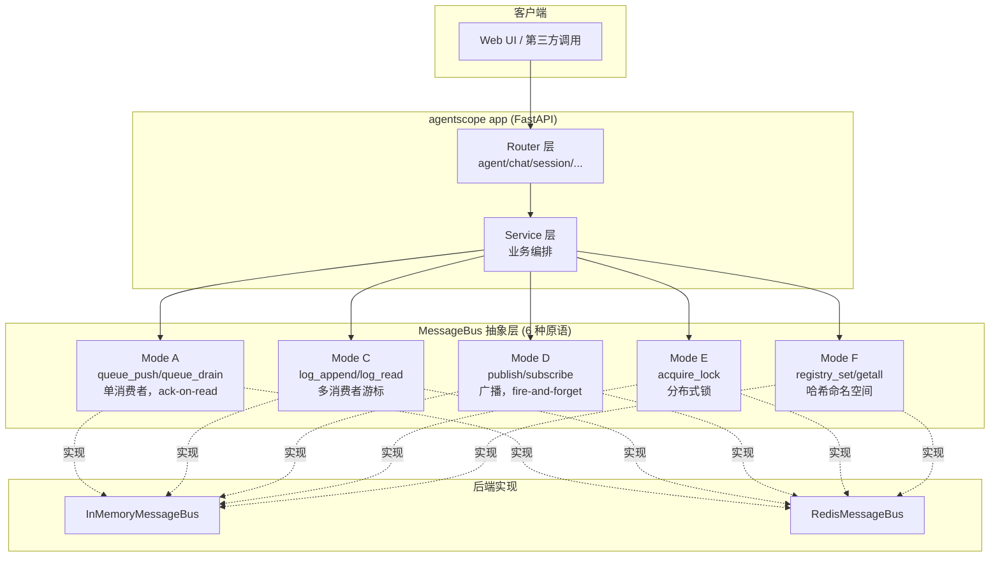
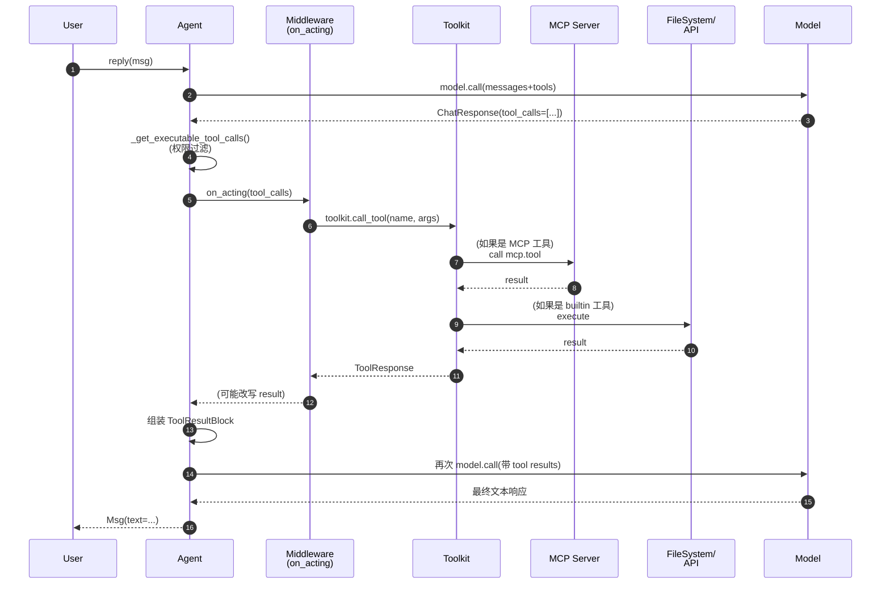

# AgentScope 2.0 架构全景图

> ## ⚠️ 学习地图 / 未经验证
> **本文档是"学习目标"，不是"学习成果"**。
> 2026-07-18 写于 AI 协作，作者尚未亲自深入代码验证。**真实学习需从 `src/agentscope/agent/_agent.py` 重新开始**。
> 详细反思见 [`notes/personal/2026-07-19-重置与真学习.md`](../personal/2026-07-19-重置与真学习.md)。

---

> **版本**：v2.0.4.post1
> **代码基线**：`sunrong1/agentscope` @ `30ca3ef`
> **学习者**：Dave (sunrong1)
> **产出日期**：2026-07-18
> **状态**：Phase 1 - Task 1 完成（骨架图 + 数据流），分布式拓扑图待补（W1-D5）

---

## 1. 顶层一句话

**AgentScope = 单一 `Agent` 类 + 中间件钩子链 + 多模式消息总线 + FastAPI 装配层。**

跟 LangChain、AutoGen 的"按子类拆分 Agent（ReActAgent / PlanAndExecuteAgent…）"的路线不同，AgentScope 2.0 走的是"一个统一类、靠 Middleware 插拔"的路子。这是这个项目最重要的架构决策。

---

## 2. 四层架构总览

```mermaid
graph TB
    subgraph L1["L1 - 用户入口层（SDK & Server）"]
        SDK["SDK 用法<br/>as_agent / ReActAgent<br/>agentscope.agent.Agent"]
        SERVER["Server 入口<br/>agentscope.app.create_app()<br/>返回 FastAPI app"]
    end

    subgraph L2["L2 - 核心抽象层（Core Abstractions）"]
        AGENT["Agent (统一类)<br/>_agent.py:102"]
        TOOLKIT["Toolkit<br/>tool/_toolkit.py"]
        MIDDLEWARE["MiddlewareBase + 6 个 hook<br/>middleware/_base.py"]
        MSGBUS["MessageBus (6 种原语)<br/>app/message_bus/_base.py"]
        STATE["AgentState / StateBase<br/>state/_state.py"]
        PERM["PermissionEngine<br/>permission/_engine.py"]
    end

    subgraph L3["L3 - 领域能力层（Domain Capabilities）"]
        TOOL["tool/<br/>_builtin / _task / mcp"]
        MEM["middleware/_longterm_memory/<br/>agentic_memory / mem0 / reme"]
        RAG["rag/<br/>chunker / parser / vdb / knowledge"]
        TRACING["middleware/_tracing/<br/>OTel 适配"]
        SKILL["skill/<br/>提示词技能"]
        WS["workspace/<br/>docker / k8s / e2b / daytona"]
    end

    subgraph L4["L4 - 基础设施适配层（Adapters）"]
        MODEL["model/<br/>dashscope / openai / deepseek /<br/>anthropic / gemini / ollama / xai / moonshot"]
        EMBED["embedding/<br/>4 家供应商"]
        TTS["tts/<br/>dashscope / openai"]
        FORMATTER["formatter/<br/>提示词格式化"]
        CRED["credential/<br/>凭据工厂"]
    end

    L1 --> L2
    L2 --> L3
    L3 --> L4

    classDef l1 fill:#e3f2fd,stroke:#1976d2
    classDef l2 fill:#fff3e0,stroke:#f57c00
    classDef l3 fill:#f3e5f5,stroke:#7b1fa2
    classDef l4 fill:#e8f5e9,stroke:#388e3c
    class SDK,SERVER l1
    class AGENT,TOOLKIT,MIDDLEWARE,MSGBUS,STATE,PERM l2
    class TOOL,MEM,RAG,TRACING,SKILL,WS l3
    class MODEL,EMBED,TTS,FORMATTER,CRED l4
```



**关键观察**：
- L1 → L2 → L3 → L4 是严格单向依赖（无环）
- L2 才是"架构的心脏"，L3 是"可插拔能力"，L4 是"供应商适配"
- 任何修改 L2 的 PR 都需要 PR Review 全员审；L3/L4 是常规 PR

---

## 3. 核心抽象：单一 Agent 类的钩子链

```mermaid
graph LR
    A[用户调用<br/>await agent.reply(msg)] --> B[_reply]
    B --> C1[on_reply<br/>middleware hook]
    C1 --> D[ReAct 主循环]
    D --> E1[on_reasoning<br/>hook]
    E1 --> E2[_reasoning<br/>→ model.call]
    E2 --> E3[on_model_call<br/>hook]
    E3 --> F{需要工具?}
    F -->|是| G1[on_acting<br/>hook]
    G1 --> G2[_acting<br/>→ toolkit.call]
    G2 --> D
    F -->|否| H[组装最终 Msg]
    H --> I1[on_reply 收尾]
    I1 --> J[reply_stream 产出 events]
    J --> K[用户收到 Msg]
```

**Agent 类构造参数**（`_agent.py:105`）：
- `name / system_prompt / model / toolkit`
- `middlewares: list[MiddlewareBase]` ← 扩展点
- `state: AgentState` ← 状态隔离
- `offloader: Offloader` ← 上下文卸载到 workspace
- `model_config / context_config / react_config` ← 行为配置

**6 个 Middleware 钩子**（`_agent.py:155-170`）：
| 钩子 | 触发时机 | 典型用途 |
|---|---|---|
| `on_reply` | 整个 reply 入口/出口 | 限流、计时、权限 |
| `on_reasoning` | 模型推理前后 | 输出改写、guardrails |
| `on_acting` | 工具调用前后 | 工具白名单、脱敏 |
| `on_model_call` | 实际调用 model | 成本统计、fallback |
| `on_system_prompt` | 拼装 system prompt 时 | 动态注入上下文 |
| `on_compress_context` | 上下文压缩 | 自定义压缩策略 |

**架构含义**：所有"框架特性"都是 Middleware 实现。Agent 类本身只负责编排。这意味着：
- ✅ 加新能力 = 写一个 Middleware，不用碰 Agent 类
- ✅ 用户的 Agent 行为 = 基础 Agent + 一组 Middleware 链（可组合）
- ⚠️ 风险：Middleware 多了会形成"隐式调用图"，排查困难 → 这就是为什么 `tracing` 必须是 Middleware

---

## 4. 多 Agent 通信：MessageBus 抽象



**6 种原语对应业务场景**（`_base.py` 注释 + 命名约定）：

| 模式 | 业务用途 | 关键 API |
|---|---|---|
| A 队列 | Session inbox、跨进程任务投递 | `queue_push` / `queue_drain` |
| C 日志 | Session 事件流（可重放） | `log_append` / `log_read` / `log_trim` |
| D 广播 | 唤醒信号、取消信号 | `publish` / `subscribe` |
| E 锁 | Session 互斥（同一 session 不并发） | `acquire_lock` / `is_locked` |
| F 注册表 | 后台任务注册 | `registry_set` / `registry_getall` |

**关键设计决策**（`_base.py` 顶部注释）：**不暴露"广播到 N 个消费者"原语**。需要 fan-out 就在 producer 端用 Mode A 给 N 个收件箱各推一份。理由：Redis Streams 的 XREADGROUP 协调代价大，让 producer 负责去重，bus 接口保持简单。

**架构含义**：
- ✅ Storage（持久化）和 MessageBus（实时传输）是**正交的两层**，可以独立选型
- ✅ 单测用 InMemoryMessageBus，生产用 RedisMessageBus，对业务代码完全透明
- ⚠️ 跨 session 的"状态"在 Storage，"心跳"在 MessageBus，两套要同时设计

---

## 5. 工具调用流（端到端）



**工具来源 3 种**（`tool/__init__.py`）：
1. **builtin**：本地 Python 函数（`tool/_builtin/`）
2. **MCP**：通过 Model Context Protocol 远程调用（`mcp/`）
3. **task tool**：把"调用其他 agent"包成工具（`tool/_task/`）

**架构含义**：
- 所有工具都走 `Toolkit.call_tool` 这一个入口 → 中间件只需 hook 一处
- MCP 的接入使得"工具"和"能力"可以分离部署，是云原生趋势
- `_task` 工具让"多 agent"看起来就是"agent 自己调一个工具"，降低心智负担

---

## 6. App 层装配（`agentscope.app.create_app()`）

```mermaid
graph TB
    FACTORY["create_app()<br/>app/_app.py:50"] --> STORAGE["StorageBase<br/>app/storage/"]
    FACTORY --> BUS["MessageBus<br/>app/message_bus/"]
    FACTORY --> WM["WorkspaceManager<br/>app/workspace_manager/"]
    FACTORY --> KBM["KnowledgeBaseManager (opt)<br/>app/rag/knowledge_base_manager/"]
    FACTORY --> POL["ResourceAccessPolicy<br/>app/access/"]
    FACTORY --> R1["agent_router"]
    FACTORY --> R2["chat_router"]
    FACTORY --> R3["session_router"]
    FACTORY --> R4["schedule_router"]
    FACTORY --> R5["credential_router"]
    FACTORY --> R6["model_router"]
    FACTORY --> R7["tts_model_router"]
    FACTORY --> R8["knowledge_base_router"]
    FACTORY --> R9["workspace_router"]
    FACTORY --> EM["extra_middlewares<br/>(FastAPI 层)"]
    FACTORY --> EAM["extra_agent_middlewares<br/>(Agent 层钩子)"]
    FACTORY --> EAT["extra_agent_tools<br/>(默认工具集)"]
    FACTORY --> ST["custom_subagent_templates"]
    FACTORY --> CAC["custom_agent_cls"]
```



**两种使用模式**（`_app.py:65-99` 注释）：

```python
# 模式 A：独立启动
app = create_app(storage=..., message_bus=..., workspace_manager=...)
uvicorn.run(app, host="0.0.0.0", port=8000)

# 模式 B：挂载到现有 FastAPI
root = FastAPI()
root.mount("/agentscope", create_app(...))
```

**可注入的扩展点**（看 `create_app` 签名）：
- `extra_credentials`：新增凭据类型
- `extra_middlewares`：FastAPI 通用中间件（CORS、auth）
- `extra_agent_middlewares`：所有 Agent 共享的中间件
- `extra_agent_tools`：所有 Agent 默认带上的工具
- `custom_subagent_templates`：子 agent 模板（多 agent 编排）
- `custom_agent_cls`：替换整个 Agent 类（⚠️ 高阶玩法）
- `resource_access_policy`：资源访问策略

**架构含义**：
- 整个 App 就是一个依赖注入容器，符合"显式优于隐式"
- `custom_agent_cls` 是终极扩展点，但官方注释暗示"慎用"

---

## 7. 待补：分布式部署拓扑（W1-D5）

> ⏳ 下一份笔记交付物：W1-D5 `notes/phase-1/distributed-topology.md`
> 包含：多副本 Session 锁、Redis Stream 选型、Workspace 沙箱边界、负载均衡策略

---

## 8. 一句话架构评判

**优点**：
- 单一 Agent 类 + Middleware = 极高的扩展性
- MessageBus 的 6 种原语抽象干净，不重不漏
- Adapter 层完全独立，换供应商不影响业务
- FastAPI 装配式注入，可云原生化

**局限**：
- 中间件多后调用链不直观（必须有 Tracing）
- 文档对 MessageBus 6 种原语的使用边界讲得不够，需要读 `_base.py` 注释
- 单一 Agent 类对"非 ReAct 类推理模式"（如 MapReduce、Hierarchical Planning）支持需自查
- Workspace 沙箱支持 5 种后端（docker/k8s/e2b/daytona/opensandbox），运维复杂度高

---

## 9. 文件索引（按主题）

| 主题 | 关键文件 |
|---|---|
| Agent 主体 | `src/agentscope/agent/_agent.py` (2911 行) |
| Agent 配置 | `src/agentscope/agent/_config.py` |
| Middleware 基类 | `src/agentscope/middleware/_base.py` |
| Tracing | `src/agentscope/middleware/_tracing/_trace.py` |
| Toolkit | `src/agentscope/tool/_toolkit.py` |
| Tool 基类 | `src/agentscope/tool/_base.py` |
| MessageBus 抽象 | `src/agentscope/app/message_bus/_base.py` |
| MessageBus 内存实现 | `src/agentscope/app/message_bus/_in_memory_message_bus.py` |
| MessageBus Redis 实现 | `src/agentscope/app/message_bus/_redis_message_bus.py` |
| App 工厂 | `src/agentscope/app/_app.py` |
| 路由层 | `src/agentscope/app/_router/` |
| Service 层 | `src/agentscope/app/_service/` |
| Manager 调度 | `src/agentscope/app/_manager/_scheduler/` |
| 权限 | `src/agentscope/permission/_engine.py` |
| 状态 | `src/agentscope/state/_state.py` |
| 事件类型 | `src/agentscope/event/__init__.py` |
| 模型适配 | `src/agentscope/model/_dashscope/` 等 |
| 沙箱 | `src/agentscope/workspace/_docker/` 等 |

---

## 10. 自我验证（按 deepseek 标准）

- [x] **能拆解**：画出了 4 层架构 + 6 大原语 + 工具调用流
- [x] **能扩展路径已识别**：写 Middleware / 写 Router / 写 Adapter 三条路
- [x] **能排错起点**：先看 Middleware 链 → 再看 MessageBus 队列 → 再看 Storage
- [x] **能评判**：第 8 节给出

✅ Phase 1 任务 1 验收通过。
