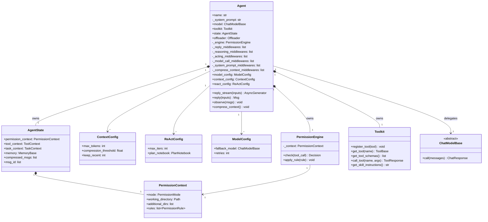
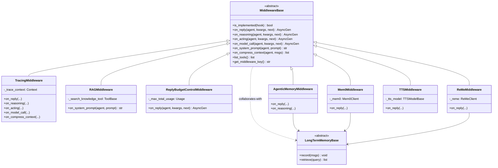
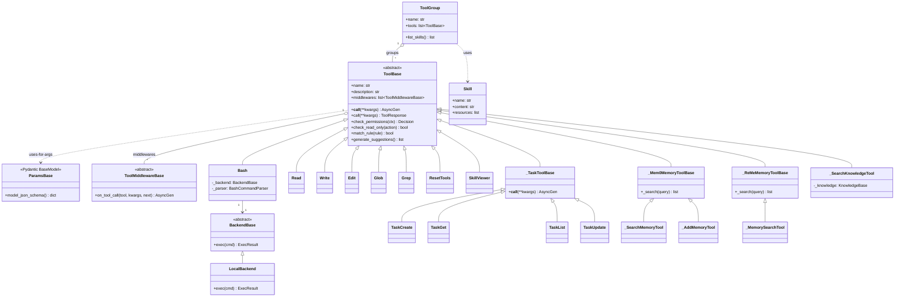
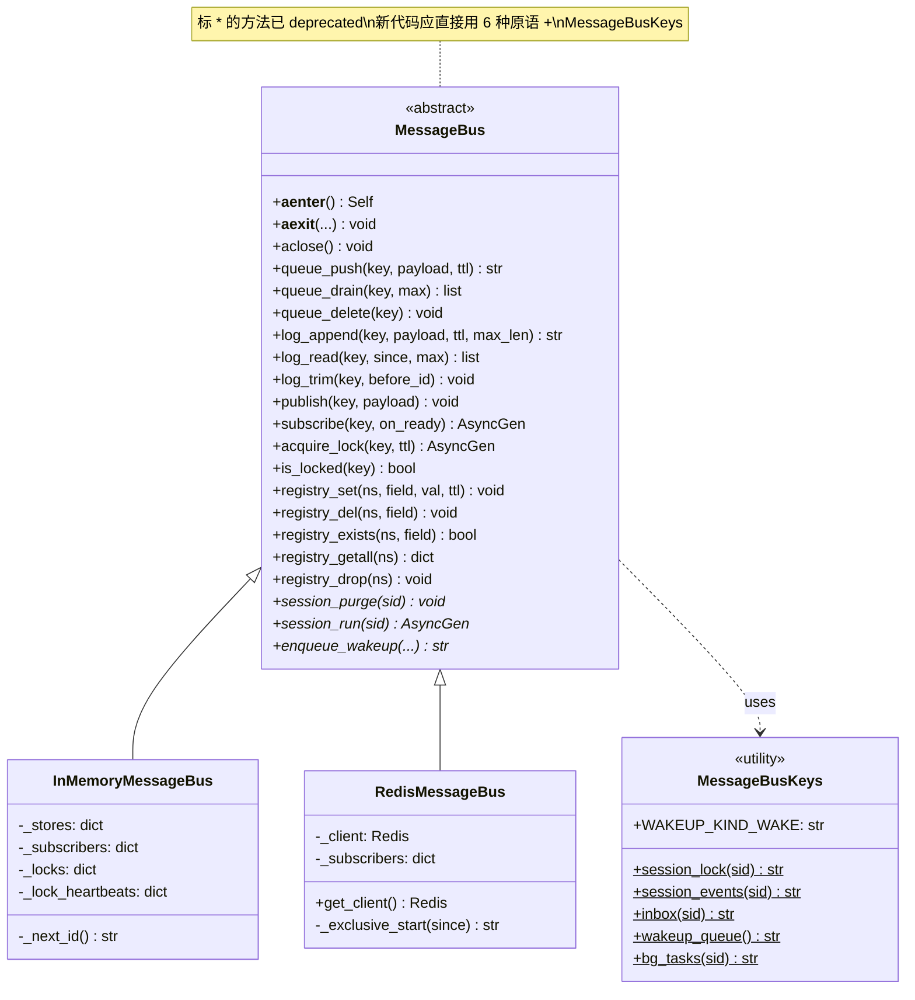
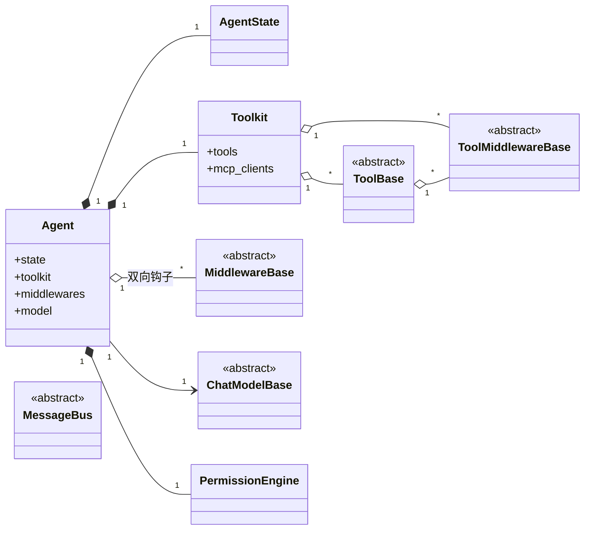

# AgentScope 2.0 核心类图

> **配套**：`architecture.md`（架构全景图）— 本文是它的"骨架图"补充
> **代码基线**：`sunrong1/agentscope` @ `30ca3ef`
> **产出日期**：2026-07-18
> **状态**：Phase 1 - Task 2 完成

本文用 Mermaid classDiagram 画出 4 大核心抽象的类继承 / 组合关系。所有类都标注了 `file:line`，方便跳源码。

---

## 1. Agent 类族（核心中的核心）

**关键观察**（架构师视角）：

- **Agent 是组合之王**：7 个核心组件，1 个聚合（owns），其余都是"有"的关系 → 易测试、易替换
- **配置三件套独立于 Agent 实体**（`ModelConfig` / `ContextConfig` / `ReActConfig`）→ 同一种 Agent 可以有"穷举版"和"精打细算版"
- **`_reply_middlewares` 等是按 hook 分桶的 list**，不是混在一起 → 调用时序可预测
- **AgentState 是聚合根**（聚合了权限/工具上下文/任务上下文/记忆/压缩历史）→ 这就是"Agent 的内在世界"

**踩坑提示**：
- 不要去继承 Agent（注释里写了 `custom_agent_cls` 是高阶玩法）
- 改 Agent 行为 = 加 Middleware 或换 Config，不要 override 方法

源码锚点：
- Agent 主类：`src/agentscope/agent/_agent.py:102`
- AgentState：`src/agentscope/state/_state.py:149`
- ContextConfig：`src/agentscope/agent/_config.py:51`
- ReActConfig：`src/agentscope/agent/_config.py:142`
- ModelConfig：`src/agentscope/agent/_config.py:183`
- PermissionEngine：`src/agentscope/permission/_engine.py:17`

---

## 2. MiddlewareBase 派生体系

**关键观察**：

- **6 种实现 + 1 个抽象基类**，覆盖了所有非业务可插拔能力
- **3 种 LongTermMemory 实现**（Agentic / Mem0 / ReMe）都挂在 Middleware 钩子上 → 记忆系统不污染 Agent 主类
- **RAGMiddleware 只用 `on_system_prompt` 一个钩子** → 最小侵入，检索结果直接注入到 system prompt
- **TracingMiddleware 用 5 个钩子** → 最重，因为它要观测所有路径

**踩坑提示**：
- `on_reply` 里的 `next_handler` 一定要 `await` 或 `async for` 调用，否则整条链断掉
- `on_system_prompt` 签名是同步（不是 async generator），其他 4 个是 async generator → 这是"洋葱模型"和"transformer 管线"的区别
- `is_implemented` 通过比较 `type(self).method` 和 `MiddlewareBase.method` 是否相等来判断 → 子类不重写就算"未实现"，运行时自动跳过

源码锚点：
- 基类：`src/agentscope/middleware/_base.py:12`
- Tracing：`src/agentscope/middleware/_tracing/_trace.py`
- RAG：`src/agentscope/middleware/_rag.py:456`
- Budget：`src/agentscope/middleware/_budget.py:21`
- AgenticMemory：`src/agentscope/middleware/_longterm_memory/_agentic_memory/_middleware.py:359`
- Mem0：`src/agentscope/middleware/_longterm_memory/_mem0/_middleware.py:86`
- ReMe：`src/agentscope/middleware/_longterm_memory/_reme/_middleware.py:85`
- TTS：`src/agentscope/middleware/_tts_middleware.py`

---

## 3. ToolBase 派生体系

**关键观察**：

- **3 大族系**：
  - **builtin 工具族**（Bash/Read/Write/Edit/Glob/Grep）— 文件/Shell 操作，Agent 的"手脚"
  - **task 工具族**（TaskCreate/Get/List/Update）— 多 agent 编排的"连接器"
  - **memory 工具族**（SearchMemory / AddMemory / SearchKnowledge）— 记忆/RAG 暴露给 agent 的入口
- **`_TaskToolBase` 的巧妙设计**：把"调另一个 agent"包装成"调一个工具" → 降低 agent 心智负担
- **`ToolGroup` 不是基类，是组合**（o-- 关系）→ 工具可以"打包"再注册到 Toolkit，比如"开发工具组"包含 Read/Write/Edit
- **`ToolMiddlewareBase` 与 `MiddlewareBase` 是平行的**两套钩子系统（一个包 Agent，一个包 Tool）→ 双层洋葱模型

**踩坑提示**：
- 自定义工具必须继承 `ToolBase` 并提供 `name` / `description` / `__call__`
- `ParamsBase` 的作用是**去掉 JSON schema 里的 title 字段**（很多 LLM 不喜欢这个字段）→ 自定义参数类必须继承它
- 工具的 `__call__` 是 async generator，`call` 是单次返回 → 流式和非流式都走同一条路径

源码锚点：
- ToolBase：`src/agentscope/tool/_base.py:94`
- ToolMiddlewareBase：`src/agentscope/tool/_base.py:36`
- ToolGroup：`src/agentscope/tool/_tool_group.py:10`
- ParamsBase：`src/agentscope/tool/_base.py:23`
- Task 工具族：`src/agentscope/tool/_task/`
- Mem0 工具族：`src/agentscope/middleware/_longterm_memory/_mem0/_tools.py`

---

## 4. MessageBus 派生体系

**关键观察**：

- **抽象层只有 5 类原语 + 1 类 lock**（共 6 种语义），所有具体实现（InMemory/Redis/未来的 NATS/Kafka）都遵守同一套接口
- **`InMemoryMessageBus` 的字段全在内存**（`_stores`/`_subscribers`/`_locks`）→ 单进程用，重启丢数据
- **`RedisMessageBus` 把数据放在 Redis，自己只维护订阅者映射** → 多进程/多副本，但 stream 操作在 Redis
- **`MessageBusKeys` 是命名约定的单点定义**（类变量方法，返回 redis key）→ 想改 key 格式只动一处
- **每个 deprecated 方法（如 `session_run`）都是 5 行 wrapper，调用对应原语** → 平滑迁移路径

**踩坑提示**：
- 选 `InMemory` 跑单测 / 演示，选 `Redis` 跑生产 / 多副本
- 自定义后端（未来可能有 NATS）只需实现 6 个原语即可
- deprecated 方法虽然能跑，但 CI 警告会很明显，建议新代码直接用原语

源码锚点：
- MessageBus 抽象：`src/agentscope/app/message_bus/_base.py:65`
- InMemory 实现：`src/agentscope/app/message_bus/_in_memory_message_bus.py:29`
- Redis 实现：`src/agentscope/app/message_bus/_redis_message_bus.py:19`
- Key 工具：`src/agentscope/app/message_bus/_keys.py`

---

## 5. 全景类图（四大体系汇总）

**架构师视角总结**（这张图最重要）：

- **Agent 是 4 个 OOP 关系的中心**：
  1. **聚合**（AgentState、Toolkit、PermissionEngine、Model）— 生命周期同生共死
  2. **双向钩子**（Middlewares）— 用函数回调而非继承扩展
  3. **可替换依赖**（Model、Storage、MessageBus）— 运行时注入
- **Toolkit 是"子 Agent"** — 它内部又有自己的 Middleware（ToolMiddlewareBase），形成**双层洋葱**
- **没有循环依赖**：4 个核心抽象（Agent / Toolkit / MiddlewareBase / MessageBus）之间是清晰的有向无环图

---

## 6. 类索引表（速查用）

| 抽象 | 关键实现 | 源文件 |
|---|---|---|
| `Agent` | 唯一实现（统一类） | `agent/_agent.py:102` |
| `AgentState` | 唯一实现 | `state/_state.py:149` |
| `Toolkit` | 唯一实现 | `tool/_toolkit.py:66` |
| `ToolGroup` | 唯一实现 | `tool/_tool_group.py:10` |
| `ToolBase` | 8 个 builtin + 4 个 task + 5 个 memory | `tool/_base.py:94` |
| `ToolMiddlewareBase` | 抽象 | `tool/_base.py:36` |
| `MiddlewareBase` | 6 个内置（Tracing/RAG/Budget/3 记忆/TTS） | `middleware/_base.py:12` |
| `MessageBus` | InMemory / Redis | `app/message_bus/_base.py:65` |
| `PermissionEngine` | 唯一实现 | `permission/_engine.py:17` |
| `ChatModelBase` | 8 家供应商 | `model/` |

---

## 7. 自我验证（按 deepseek 标准）

- [x] **能拆解**：画了 5 张类图，覆盖 4 大核心抽象
- [x] **能扩展路径已识别**：每个基类都列出了"现有实现 + 怎么加新实现"
- [x] **能排错起点**：类关系图 = 排查"哪个类在哪个文件"的快速地图
- [x] **能评判**：踩坑提示散落各图

✅ Phase 1 - Task 2 完成。

---

## 8. 下一步

- **W1-D3-4**：用 1-2 小时画 Mermaid **时序图**（agent.reply 的完整时序、tool call 的完整时序），跟类图配合
- **W1-D5**：补分布式拓扑图（`distributed-topology.md`）
- **W1-D6**：架构评判（ADR 格式 3 个关键决策）
- **W1-D7**：写公开承诺发布
