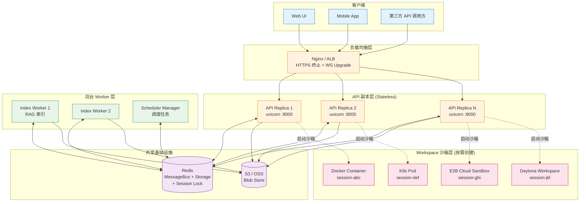
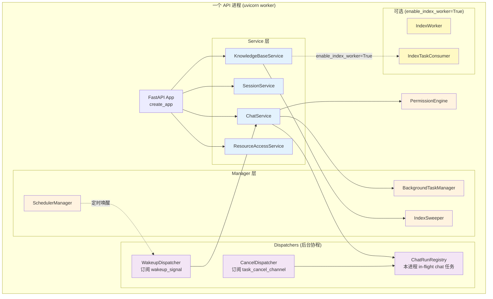
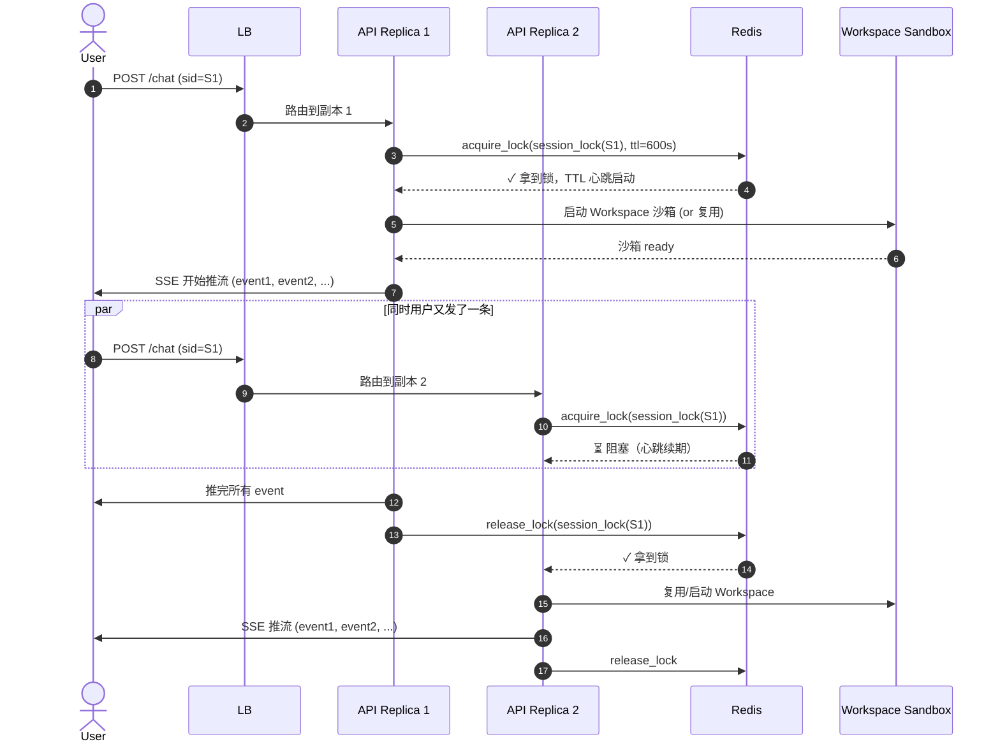
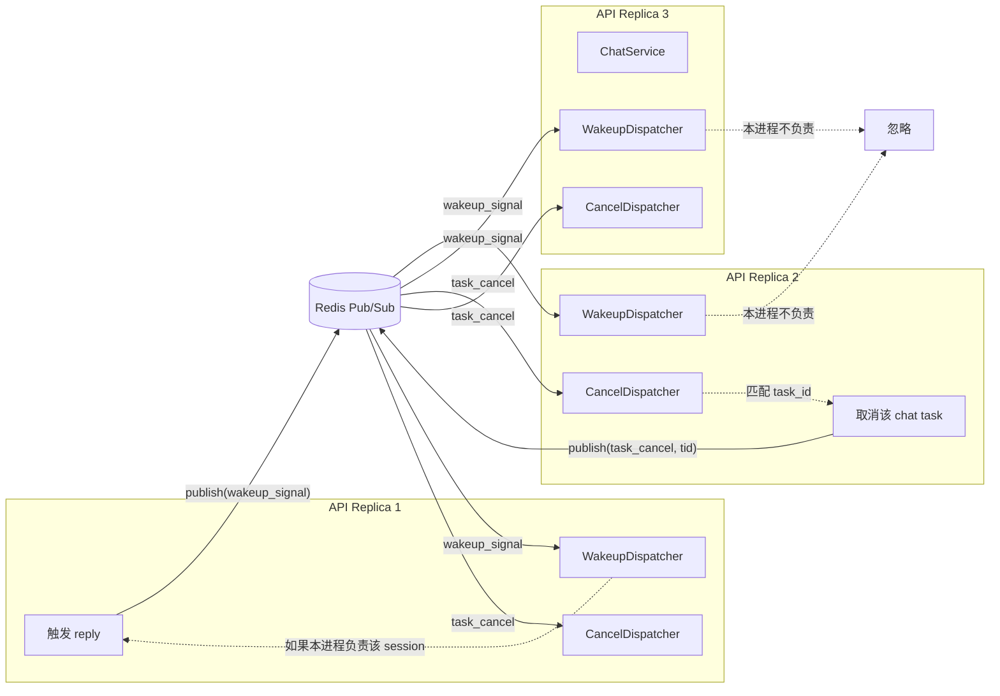
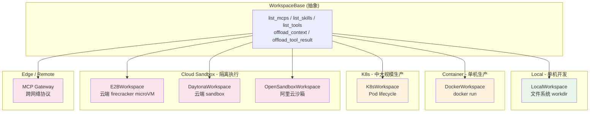
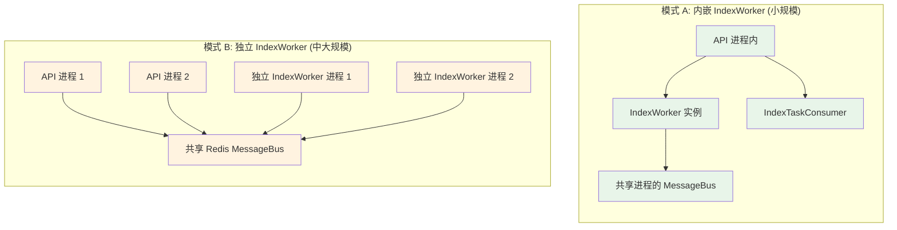
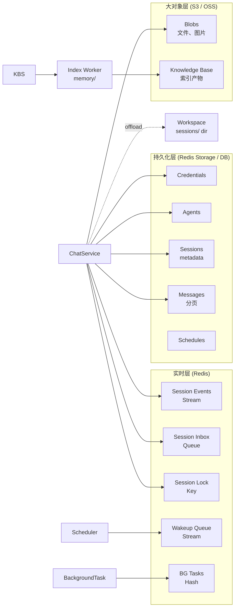

# AgentScope 2.0 分布式部署拓扑

> **配套**：`architecture.md`（架构全景） + `class-diagrams.md`（类族） + `sequence-diagrams.md`（时序）— 本文件是它们的"多副本投影"
> **代码基线**：`sunrong1/agentscope` @ `30ca3ef`
> **产出日期**：2026-07-18
> **状态**：Phase 1 - Task 4 完成

单进程模式（`InMemoryMessageBus` + `LocalWorkspace`）很好理解，但生产环境必须**多副本**。本文件梳理 AgentScope 在分布式模式下的拓扑、并发保证、故障恢复。

---

## 1. 生产拓扑总览

**关键设计决策**：

- **API 副本是 Stateless**——所有状态在 Redis，所以副本数可任意扩缩（水平扩展）
- **Workspace 沙箱不共享**——每个 session 的沙箱在用哪个副本就建在哪（生命周期跟着 session）
- **Worker 是可独立扩展的层**——和 API 解耦，扩缩容不影响主链路
- **Redis 是"单一数据源"**——Storage + MessageBus + Session Lock + 任务队列都在这里

---

## 2. 单个 API 副本的进程内结构

**关键观察**：

- **Dispatchers 是后台长跑协程**——它们订阅 message_bus 的 channel，被触发后调用 service 层
- **`ChatRunRegistry` 是 per-process**（不是共享）—— 它的作用是"本进程内哪些 chat 任务在跑"
- **IndexWorker 可内嵌可外置**（`enable_index_worker=True/False`）—— 内嵌时省部署，外置时扩缩容灵活
- **`PermissionEngine` 实例 per request**（不是全局）—— 每个请求独立做权限决策

源码锚点：
- 进程初始化：`src/agentscope/app/_lifespan.py`
- `WakeupDispatcher`：`src/agentscope/app/_manager/_wakeup_dispatcher.py:61`
- `CancelDispatcher`：`src/agentscope/app/_manager/_cancel_dispatcher.py:28`
- `ChatRunRegistry`：`src/agentscope/app/_manager/_chat_run_registry.py:23`
- `BackgroundTaskManager`：`src/agentscope/app/_manager/_background_task_manager.py:216`

---

## 3. 分布式 Session 互斥（时序 + 副本视图）

**关键观察**：

- **Session 锁保证**：`同一 session 在同一时刻只有 1 个副本在执行 reply`——避免状态冲突
- **TTL=600s + 心跳**——API1 的 long-running reply 不会因 TTL 过期而丢锁
- **API1 crash 也不会死锁**——600s 后 API2 自动接管
- **Workspace 沙箱跟 session 走**——A 副本建的沙箱，B 副本接手后通过序列化状态能继续

源码锚点：
- `acquire_lock` 实现：`src/agentscope/app/message_bus/_redis_message_bus.py`（具体行需查）
- Lock 原语定义：`src/agentscope/app/message_bus/_base.py:386`

---

## 4. 跨副本事件传播（Wakeup / Cancel）

**关键观察**：

- **每个 API 副本都订阅了 wakeup_signal 和 task_cancel**——Redis Pub/Sub 广播给所有订阅者
- **每个 Dispatcher 收到事件后自决**——只处理本进程负责的（通过 `ChatRunRegistry` 查任务归属）
- **不负责的事件被丢弃**——所以"广播一次，每个副本决定要不要处理"是 O(N) 副本数，不是 O(N) 任务数
- **Wakeup 信号是 fire-and-forget**——**只通知当前在线的副本**，离线时丢消息（不持久化），所以**重要的任务通过 inbox queue 投递**

源码锚点：
- `WakeupDispatcher`：`src/agentscope/app/_manager/_wakeup_dispatcher.py`
- `CancelDispatcher`：`src/agentscope/app/_manager/_cancel_dispatcher.py`
- 关键 channel：`MessageBusKeys.wakeup_signal()`、`MessageBusKeys.task_cancel_channel()`

---

## 5. Workspace 沙箱的多后端选型

**选型矩阵**（架构师视角）：

| 后端 | 启动速度 | 隔离强度 | 成本 | 适用场景 |
|---|---|---|---|---|
| Local | 0（直接用） | ❌ 无 | $0 | 本地开发、单测 |
| Docker | 1-3s | 中（OS 级别） | 低 | 中小生产、单租户 |
| K8s | 5-15s | 中高 | 中 | 大生产、混合部署 |
| E2B | 2-5s | 高（microVM） | 中 | 多租户 SaaS |
| Daytona | 1-3s | 高 | 中 | 开发环境 |
| OpenSandbox | 2-5s | 高 | 低 | 国内云原生场景 |
| MCP Gateway | 即时 | 协议级 | 低 | 跨网络/跨语言集成 |

**关键设计观察**：

- **统一抽象层**——切换后端不改业务代码（`WorkspaceBase` 是接口）
- **Offload 机制跨后端通用**——`offload_context` 把压缩后的上下文存到 workspace 的 `sessions/` 目录
- **沙箱内运行的工具**通过 MCP 协议与 Agent 通信——沙箱是"另一台机器"，不是同进程

源码锚点：
- `WorkspaceBase`：`src/agentscope/workspace/_base.py`
- `LocalWorkspace`：`src/agentscope/workspace/_local_workspace.py`
- `DockerWorkspace`：`src/agentscope/workspace/_docker/_docker_workspace.py`

---

## 6. IndexWorker 的两种部署模式

**模式 A（enable_index_worker=True）**：
- 适合：流量小（< 100 docs/day），不想多部署一个组件
- 缺点：API 进程要承担索引工作，CPU/IO 会影响 API 响应

**模式 B（独立进程）**：
- 适合：流量大、独立扩缩容
- 启动命令：`python -m agentscope.app.rag.index_worker`
- 优点：API 进程纯净，索引独立调优

**Sweeper 始终在 API 进程**（在 `_lifespan.py:135-145`）—— 因为它是"上传后立即触发索引"的兜底机制

源码锚点：
- 内嵌逻辑：`src/agentscope/app/_lifespan.py:128-148`
- IndexWorker：`src/agentscope/app/rag/index_worker/`

---

## 7. 数据流向（持久化 + 实时 + 离线）

**存储分层**：

| 数据 | 存哪 | 生命周期 | 备份需求 |
|---|---|---|---|
| Session Events | Redis Stream | session 结束 trim | 中（重放需要） |
| Session Inbox | Redis Queue | TTL | 低（可丢） |
| Session Lock | Redis Key | TTL=600s | 不需要 |
| Credentials | Redis (Storage) | 永久 | **高** |
| Agents 配置 | Redis (Storage) | 永久 | **高** |
| Session metadata | Redis (Storage) | 永久 | **高** |
| Messages | Redis (Storage) | 永久 | **高** |
| Blobs | S3/OSS | 永久 | **极高** |
| KB 索引 | 本地文件 + S3 | 永久 | 中 |
| 沙箱 sessions/ | Workspace 内 | session 期间 | 低（可重算） |

**架构师视角**：

- **热数据 vs 冷数据分层**——Redis 存热数据，Blobs 走对象存储，**不要什么都塞 Redis**（成本和性能都不划算）
- **Session 状态分两半**—— 元数据持久化（用户能看到），事件流 Redis（用户看不到）—— 这种"用户态 vs 系统态"分离是 SaaS 标配

源码锚点：
- `StorageBase`：`src/agentscope/app/storage/_base.py:26`
- `RedisStorage`：`src/agentscope/app/storage/_redis_storage.py:47`

---

## 8. 故障恢复矩阵

| 故障 | 影响 | 恢复机制 | 备注 |
|---|---|---|---|
| **API 副本宕机** | 该副本的 in-flight chat 中断 | (1) session 锁 TTL 过期 → 其他副本接管 (2) WakeupDispatcher 在其他副本重新触发 | Redis 是 SPOF 之外的依赖 |
| **Redis 重启** | Session 锁、inbox、events 全清 | (1) 持久化配置（RDB+AOF） (2) 客户端重连 | 必须开 AOF |
| **Redis 网络分区** | 副本之间看不到彼此 | (1) 副本独立工作（最差情况重复执行） (2) 业务层做幂等 | 需要 Saga 模式 |
| **Workspace 沙箱崩溃** | 该 session 上下文丢失 | 从 Storage 重新加载 session metadata | 沙箱状态非持久化 |
| **IndexWorker 宕机** | 索引任务积压 | Sweeper 在 API 进程兜底重试 | Mode B 的核心价值 |
| **S3 不可用** | Blob 上传/下载失败 | (1) 业务重试 (2) 降级为本地存储 | 多区域复制 |

**架构师视角**：

- **Redis 是 SPOF**——生产必须主从 + Sentinel/Cluster
- **API 副本无状态**——所以可以"挂了就重启"，不丢用户数据
- **沙箱是 ephemeral**——重要状态必须 offload 到 Storage，不要依赖沙箱持久化
- **IndexWorker 故障 = 索引延迟**——不影响主链路，**这是好设计**

---

## 9. 容量规划参考

| 指标 | 单副本 (8C16G) 估计 | 多副本 (3 副本) |
|---|---|---|
| 并发 chat | ~50 | ~150 |
| QPS (非流式) | ~200 | ~600 |
| SSE 并发连接 | ~500 | ~1500 |
| Redis 内存（10000 session） | ~1 GB | ~1 GB（共享） |
| Index 吞吐 | ~50 docs/min | 独立扩展无上限 |

**扩缩容策略**：

- **API 副本**：HPA 基于 CPU/连接数
- **Redis**：垂直扩展到 32G 后考虑 Cluster
- **IndexWorker**：基于队列长度
- **Workspace 后端**：按需扩（K8s HPA / E2B 自动）

---

## 10. 自我验证（按 deepseek 标准）

- [x] **能拆解**：10 张图 + 9 章节覆盖分布式全貌
- [x] **能扩展路径已识别**：每种故障都有恢复方案
- [x] **能排错起点**：故障恢复矩阵直接对照
- [x] **能评判**：选型矩阵给出 trade-off

✅ Phase 1 - Task 4 完成。**Phase 1 全部交付物已闭环**。

---

## 11. Phase 1 完整交付物清单

| # | 文件 | 内容 |
|---|---|---|
| 1 | `LEARNING.md` | 公开承诺 |
| 2 | `notes/phase-1/architecture.md` | 架构全景（6 图） |
| 3 | `notes/phase-1/class-diagrams.md` | 类族关系（5 图） |
| 4 | `notes/phase-1/sequence-diagrams.md` | 时序图（6 图） |
| 5 | `notes/phase-1/distributed-topology.md` | 分布式拓扑（10 图）|
| 6 | `notes/phase-1/public-commit-drafts.md` | 多平台文案 |
| 7 | `notes/README.md` | 学习日志主页 |
| 8 | `notes/debug-log.md` | 错题本 |
| 9 | blog post (sunrong.site) | W1 学习总结已发布 |

**接下来进 Phase 2**：W3 开始啃 `_agent.py` 2911 行源码。

---

## 12. 下一步

- **W1-D6**：ADR 架构评判（3 个关键决策的 trade-off 文档）
- **W2 周末**：周自检，填表，看 4 个维度的"知/行/破/建"
- **Phase 2-W3**：精读 `_agent.py` 2911 行，写源码注解 + 独立 Demo
