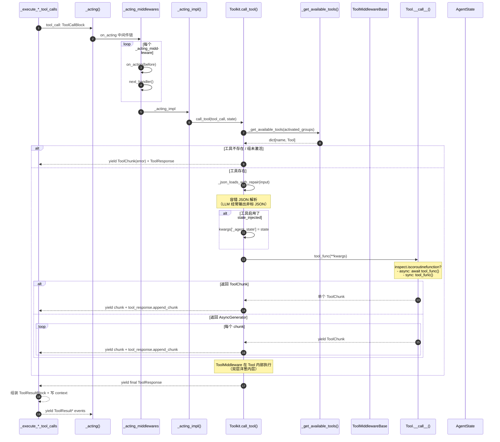
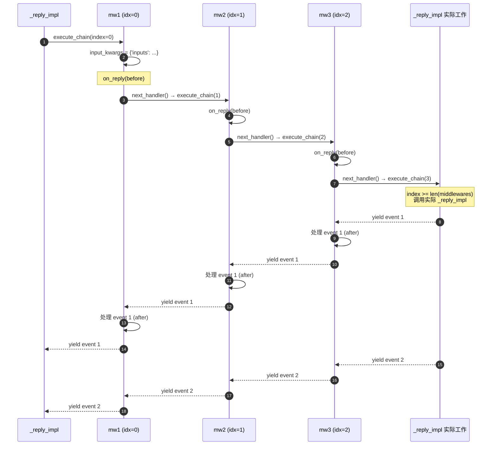
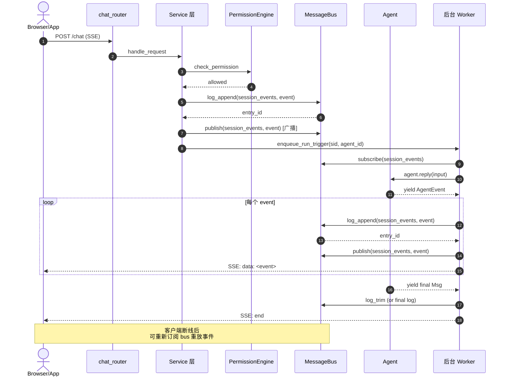
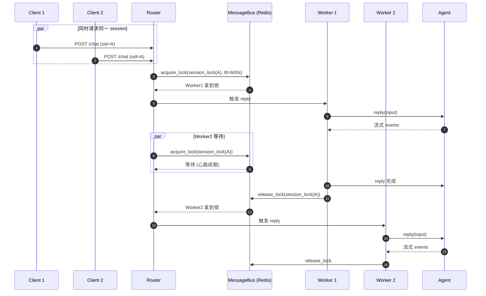
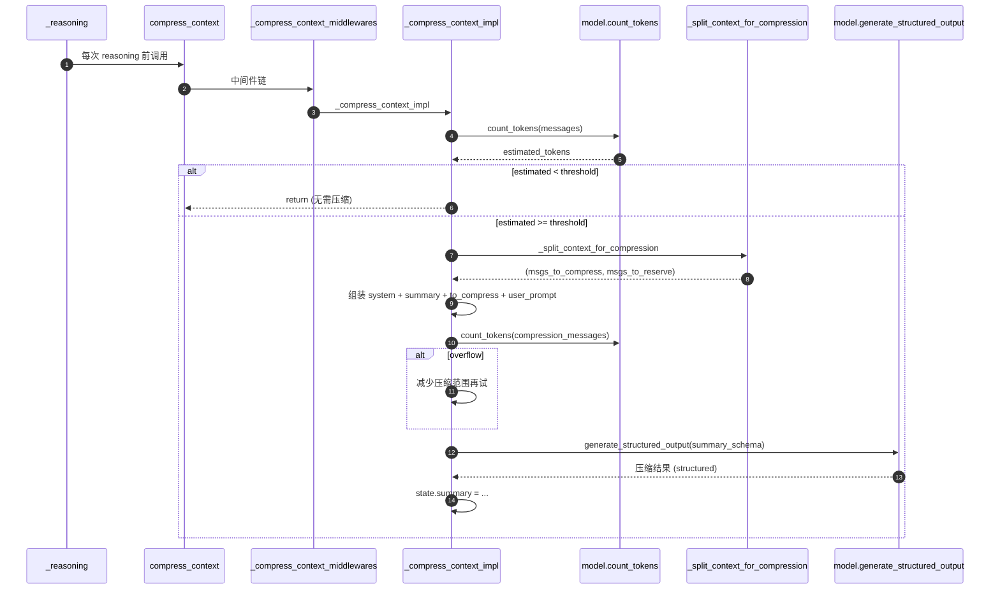

# AgentScope 2.0 核心时序图

> **配套**：`architecture.md`（架构全景） + `class-diagrams.md`（类族关系）— 本文件是它们的"时间线"补充
> **代码基线**：`sunrong1/agentscope` @ `30ca3ef`
> **产出日期**：2026-07-18
> **状态**：Phase 1 - Task 3 完成

时序图是架构图和类图的"动态投影"——把"谁调用谁"画清楚。所有图都标注了源码行号，可直接跳读。

---

## 1. `agent.reply()` 完整时序（含 Middleware 链）

```mermaid
sequenceDiagram
    autonumber
    actor User
    participant Reply as Agent.reply()
    participant ReplyMW as _reply_middlewares
    participant Impl as _reply_impl()
    participant Check as _check_incoming_event()
    participant Handle as _handle_incoming_event/messages()
    participant Loop as ReAct Loop
    participant Comp as compress_context()
    participant Reason as _reasoning()
    participant ReasonMW as _reasoning_middlewares
    participant ReasonImpl as _reasoning_impl()
    participant Model as Model (LLM)
    participant Batch as _batch_tool_calls()
    participant Act as _execute_*_tool_calls()
    participant ActMW as _acting_middlewares
    participant ActImpl as _acting_impl()
    participant Toolkit

    User->>Reply: reply(Msg)
    Reply->>Reply: reply_stream() 包装
    Reply->>ReplyMW: 进入中间件链 (execute_chain)

    loop 每个 _reply_middleware
        ReplyMW->>ReplyMW: on_reply(before)
        ReplyMW->>ReplyMW: next_handler() → 下一个 mw 或 Impl
    end

    ReplyMW->>Impl: 落到 _reply_impl(inputs)

    Impl->>Check: _check_incoming_event(event)
    Check-->>Impl: is_awaiting: bool

    alt is_awaiting = True
        Impl->>Handle: _handle_incoming_event
        Handle-->>User: yield ToolResult* events
    else is_awaiting = False
        Impl->>Handle: _handle_incoming_messages
        Impl-->>User: yield ReplyStartEvent
    end

    loop while cur_iter < max_iters
        Impl->>Loop: _check_next_action()
        alt action = exit
            Impl-->>User: yield final Msg + return
        else action = reasoning
            Impl->>Comp: compress_context() (如超阈值)
            Comp-->>Impl: ok
            Impl->>Reason: _reasoning()
            Reason->>ReasonMW: 中间件链
            ReasonMW->>ReasonImpl: _reasoning_impl
            ReasonImpl-->>User: yield ModelCallStartEvent
            ReasonImpl->>Model: model.call(messages, tools)
            Model-->>ReasonImpl: ChatResponse
            ReasonImpl-->>User: yield Text/Thinking/ToolCall deltas
            ReasonImpl-->>User: yield ModelCallEndEvent
            Reason-->>Impl: 流式 events
        end

        Impl->>Batch: _batch_tool_calls()
        Batch-->>Impl: list of (sequential/concurrent)

        alt batch.type = sequential
            Impl->>Act: _execute_sequential_tool_calls
        else batch.type = concurrent
            Impl->>Act: _execute_concurrent_tool_calls
        end

        loop 每个 tool_call
            Act->>ActMW: on_acting 中间件链
            ActMW->>ActImpl: _acting_impl
            ActImpl->>Toolkit: toolkit.call_tool(tool_call, state)
            Toolkit-->>Act: yield ToolChunk(s)
            Toolkit-->>Act: yield ToolResponse
            Act-->>User: yield ToolResult* events
        end

        Note over Impl: 检查 HITL / INTERRUPTED<br/>若需用户确认 → yield RequireUserConfirmEvent → return

        Impl->>Impl: cur_iter += 1
    end

    Impl-->>User: yield ExceedMaxItersEvent (若超 max_iters)
    Impl-->>User: yield ReplyEndEvent (finally 块)
```

**关键观察**：

- **Middleware 是递归链**（`execute_chain` 函数 + `next_handler`）—— 不是简单的 list.forEach，所以可以**修改传给下一层的 kwargs**
- **ReAct 主循环在 `_reply_impl` 内部**（Step 3.1-3.3）—— Middleware 只能在 reply 入口拦截，看不到循环内部细节
- **HITL 模式**：`_check_next_action` 会决定是否退出循环，工具的 `RequireUserConfirmEvent` 会**强制 return**（不进入下一轮 reasoning）
- **`finally` 块统一发 `ReplyEndEvent`**——所以订阅者一定能收到终止事件，不会 hang
- **CancelledError 会被 `_reply_impl` 捕获**（`interruption_raise_cancelled_error` 配置控制是否重抛）—— 这是流式响应的标准模式

源码锚点：
- `_reply` 入口：`src/agentscope/agent/_agent.py:560`
- `_reply_impl` 主体：`src/agentscope/agent/_agent.py:672`
- `_reasoning` 入口：`src/agentscope/agent/_agent.py:924`
- `_acting` 入口：`src/agentscope/agent/_agent.py:1881`
- 中间件递归模式：所有 `_*` 入口方法都用同一套 `execute_chain` 模式

---

## 2. `toolkit.call_tool()` 完整时序（含 ToolMiddleware）



**关键观察**：

- **JSON 解析用 `_json_loads_with_repair`**——LLM 经常输出非标准 JSON（缺引号、尾部逗号），框架自带容错
- **State 注入通过 `_agent_state` 参数**（仅当 `is_state_injected=True`）—— 工具可以"看到"agent 的状态，但**默认不注入**，避免污染
- **Tool 的 `__call__` 可以是 3 种类型**：coroutine、async generator、ToolChunk 单值—— Toolkit 都统一处理
- **ToolMiddleware 在 `_acting` 那一层调用，不在 Toolkit 里**——Toolkit 只负责"找到工具 + 调用 + 收集结果"，中间件是 Agent 层的概念
- **MCP 工具走不同的路径**（`is_mcp=True`）—— 通过 MCP 协议远程调用

源码锚点：
- `Toolkit.call_tool`：`src/agentscope/tool/_toolkit.py:225`
- `_get_available_tools`：`src/agentscope/tool/_toolkit.py:469`
- JSON 容错：`src/agentscope/_utils/_common.py:_json_loads_with_repair`
- ToolMiddlewareBase：`src/agentscope/tool/_base.py:36`

---

## 3. Middleware 递归链模式（细节展开）

这是所有 4 个 hook 都用的**同一套模式**。理解这一个，其他的都一样。



**关键观察**：

- **递归而非循环**——这是因为每个 mw 的 `next_handler` 是 closure，可以**捕获自己的 index** 做"在 next 之前/之后做不同事情"
- **洋葱模式**（onion pattern）—— M1 是最外层，先进后出（pre-logic → M2 pre → M3 pre → Impl → M3 post → M2 post → M1 post）
- **可以改 kwargs**—— M1 可以在调用 `next_handler(**modified_kwargs)` 时改 input，**改 M2 看到的 input**
- **可以丢弃 event**—— M1 拿到 event 后可以选择不 yield，直接丢弃（过滤模式）
- **可以注入新 event**—— M1 可以在 yield 之间插入自己的 event（注入模式）

源码锚点：
- `_reply` 的中间件链：`src/agentscope/agent/_agent.py:560-605`（看 `execute_chain`）
- 同模式 4 处：`_reply` / `_reasoning` / `_acting` / `_compress_context`

---

## 4. Server 端 SSE 流（HTTP 角度）



**关键观察**：

- **同一事件 3 个动作**：log_append（持久化）+ publish（实时广播）+ SSE 推给客户端 —— 一致性靠"先 log 再 publish"保证
- **客户端可重连重放**——log 模式（`log_read` with cursor）支持断点续传
- **Session 锁**（`acquire_lock`）保证同一 session 不会并发 reply——见下节
- **事件流是 append-only**—— `max_len=1000` 自动 trim

源码锚点：
- Chat router：`src/agentscope/app/_router/`
- Service 层：`src/agentscope/app/_service/`
- MessageBus：`src/agentscope/app/message_bus/`

---

## 5. Session 并发控制（分布式锁时序）



**关键观察**：

- **`acquire_lock` 的 TTL=600s + 心跳续期**——长任务不会因 TTL 过期而丢锁
- **Worker crash 也不会死锁**——TTL 过期后，Worker2 自动接管
- **新 session 的 inbox 是 drain queue**（Mode A）—— 离线时积压的消息不会丢
- **跨进程的 session cancel**（Mode D 广播）—— 任何 worker 都能取消任意 session

源码锚点：
- `acquire_lock`：`src/agentscope/app/message_bus/_base.py:386`
- 业务 wrapper（已 deprecated）：`session_run` 在 `_base.py:392`

---

## 6. 上下文压缩时序（`compress_context`）



**关键观察**：

- **压缩是结构化输出**（`generate_structured_output` + `summary_schema`）—— 不是简单的"前 N 句"截断
- **预留 reserve_ratio**（默认 10%）—— 保证压缩提示词本身不会爆 context
- **降级策略**：context 实在太大时，逐步丢最早的消息再试
- **Middleware 可完全接管**——比如你想用 Mem0 压缩而非 LLM 摘要，写一个 `LongTermMemoryMiddleware` 即可

源码锚点：
- `compress_context`：`src/agentscope/agent/_agent.py:283`（公开方法）
- `_compress_context_impl`：`src/agentscope/agent/_agent.py:332`

---

## 7. 自我验证（按 deepseek 标准）

- [x] **能拆解**：6 张时序图覆盖核心调用链
- [x] **能扩展路径已识别**：每个图都标了"如何加 Middleware / 如何加 Router"
- [x] **能排错起点**：SSE 流挂 / 上下文爆 / Session 死锁，每种都有时序图可对照
- [x] **能评判**：观察散落各图

✅ Phase 1 - Task 3 完成。

---

## 8. 下一步

- **W1-D5**：补分布式拓扑图（`distributed-topology.md`）
- **W1-D6**：ADR 架构评判（3 个关键决策）
- **W1-D7**：已发（公开承诺）
- **W2 周自检**：补完 W1 全部后做
